# ng-tty 介绍

将终端通过ng-client转发到NG，可以执行命令交互在内网机器。

原理:

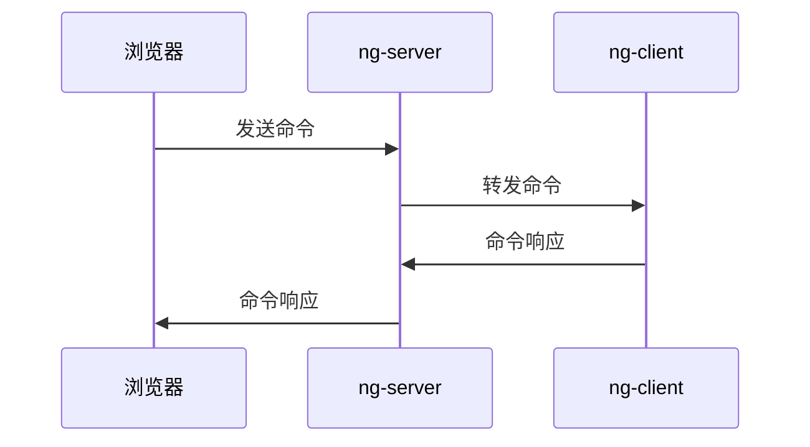

下面通过示例，演示ng-tty如何使用。

# 执行 `bash` 命令

## 创建 tty

选中创建tty的client，可以在该client下创建tty:

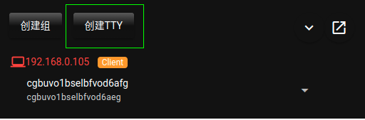

"创建TTY"

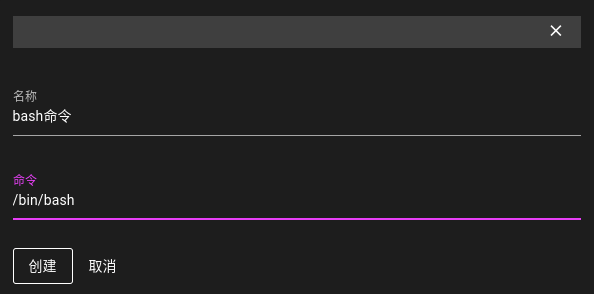

创建成功后，在client下可以看到对应的tty:

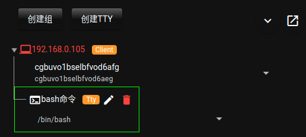

## 打开 ng-tty 面板

点击下面按钮，可以打开ng-tty 面板:

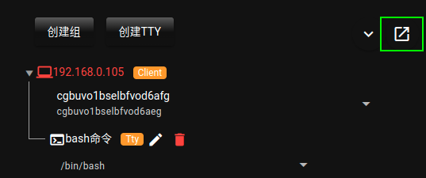

进入面板:

在右侧工具栏中可以打开对应的tty:

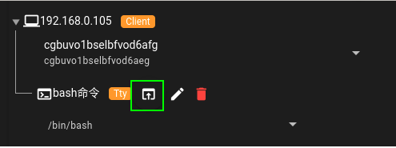

可以在tty进行命令操作:

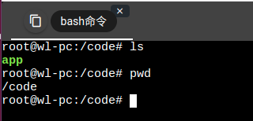

# 执行 ssh 命令

## 创建 tty

添加ssh命令，ip可以内网中其他机器的地址。

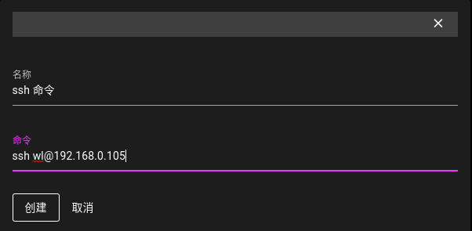

创建成功后，可以看到该tty信息:

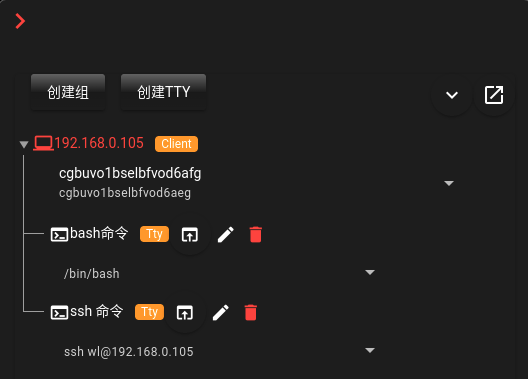

## ng-tty 面板执行ssh

要求输入目标机器的密码:

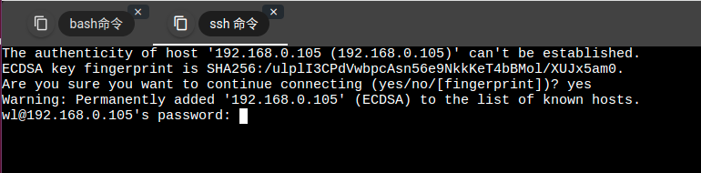

输入正确密码后，可以执行命令到ssh的机器上:

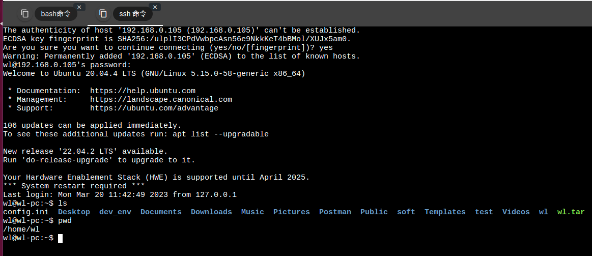
