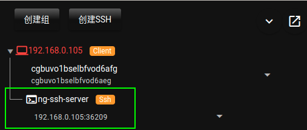

# ng-ssh 介绍

在ng-client中内置了ssh-client和ssh-server，内网机器上直接就可以使用ssh相关的服务。

原理:

下面通过示例，演示ng-ssh如何使用。

# 内置 `ng-ssh-server`

在ng-client中内置了`ng-ssh-server`。

可以看到ng-ssh-server的信息:

## 打开 ng-ssh 面板

点击下面按钮打开ng-ssh面板:

ng-ssh面板和ng-tty面板的操作一致。

通过ng-ssh面板的右侧菜单，访问ng-ssh-server:

进行命令操作:

# 配置 ssh 到内网其他机器

## 创建 ssh 配置

选择客户端，可以创建ssh:

添加ssh配置信息:

创建成功:

## ng-ssh 面板，建立访问

打开ng-ssh面板，可以访问内网其他机器:

ssh连接到内网其他机器，执行命令:

