# ng-vditor 介绍

ng-vditor 是使用[vditor](https://github.com/Vanessa219/vditor) 提供markdown文档编辑工具。方便编辑内网机器上的markdown文档。

下面介绍ng-vditor 提供的服务。

# ng-vditor 服务配置

## 配置文档根目录

默认ng-vditor的根目录为ng-client做在目录，可以通过配置界面进行修改。

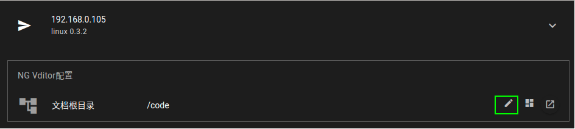

配置新的根目录:

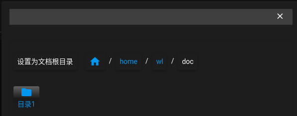

修改成功:

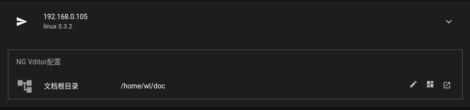

## 管理 文档根目录

点击下面按钮，可以对文档跟目录下的文件进行管理操作。

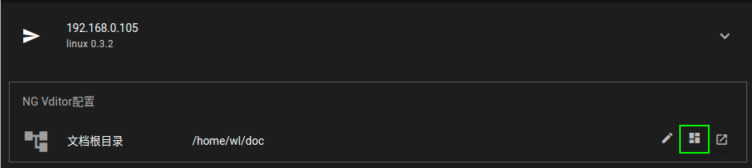

文档管理:

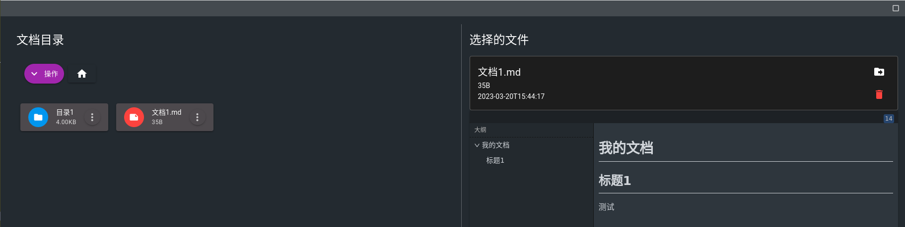

# ng-vditor 面板，文档编辑

点击下面按钮，打开文档面板:

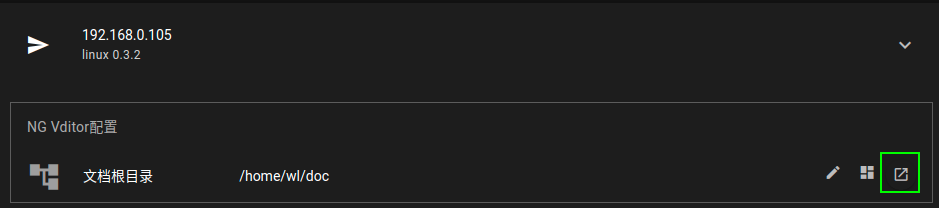

文档面板:

## 打开编辑文档目录

点击面板上的文件夹按钮，选择打开要编辑的文档文件夹:

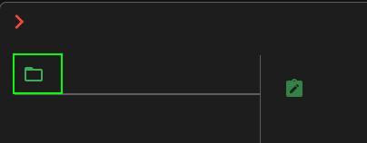

选择文档文件夹:

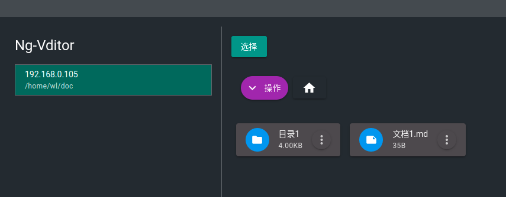

## 文档编辑

在面板中选择要编辑的文档，点击编辑按钮，可以编辑该文档。

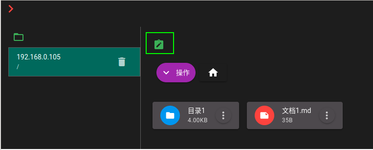

说明:

- 红色表示选中的文档或目录。
- 如果为目录可以双击进入子目录。
- 选择为文档，点击编辑按钮可以打开该文档。

打开编辑的文档:

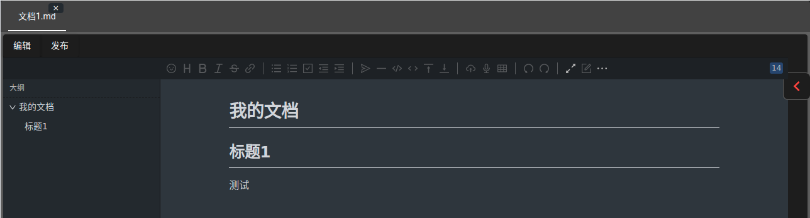

说明:

- 如果文档有内容，默认进入的为预览模式，点击编辑后可以修改文档。
- 在编辑模式下，可以直接`Ctrl+v`粘帖截图，设置图片名称后自动上传到文档所在目录的`images`目录下。

## 文档中添加图片

`Ctrl+v`粘帖截图，编辑图片名:

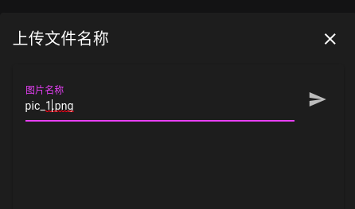

效果:

