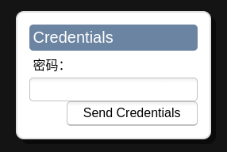

# ng-noVNC 介绍

ng-noVNC 是使用[noVCN](https://github.com/novnc/noVNC) 提供访问内网机器上的vnc，进行远程桌面操作。

下面介绍ng-noVNC如何使用。

# 内网中 vnc 服务

下面通过docker 启动一个vnc服务的容器:

```plaintext
docker run -ti --rm \
-p 15901:5901 \
wanglu119/tools:ubuntu-vnc-xfce_20.04
```

该镜像vnc server的密码为: 123456

# 创建 ng-noVNC 配置

点击添加按钮，创建ng-noVNC配置:


填写配置信息:


创建成功:


# 打开 noVNC 面板

点击下面按钮，打开noVNC面板:


进入noVNC面板:


点击"连接"，输入密码:



进入远程桌面:


