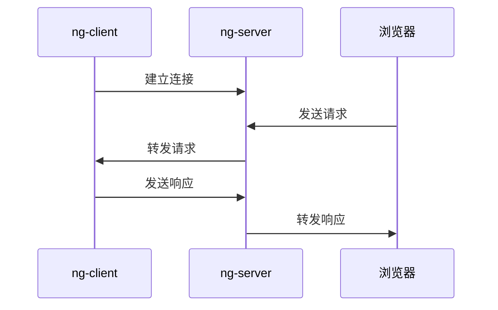
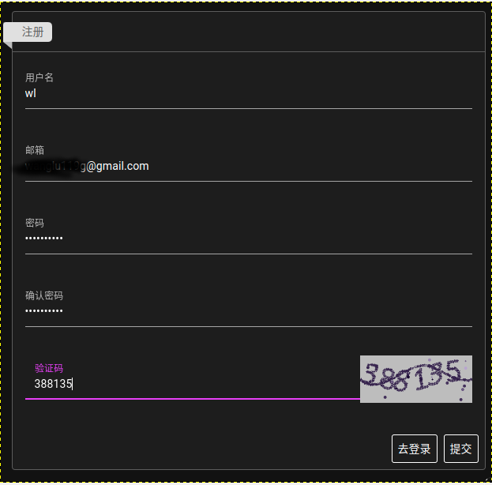
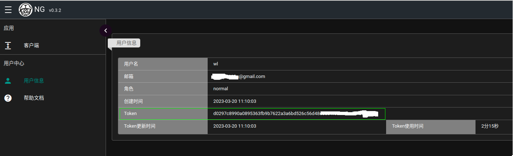
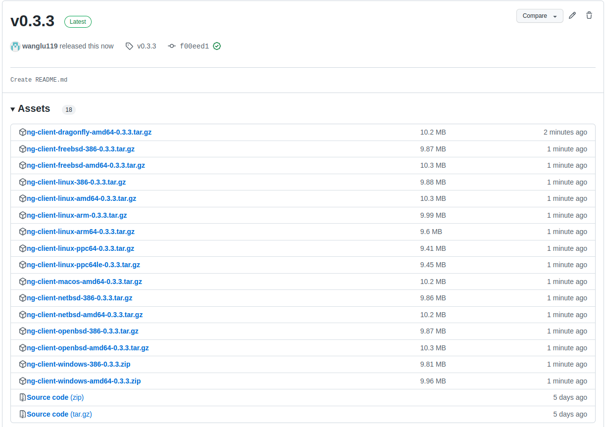
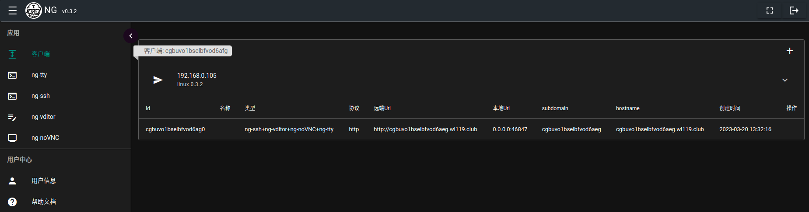

ng-client 使用

在线试用:
- 地址: http://www.wl119.club/desktop/ng-demo
- 账户: ng-demo
- 密码: ng-demo

# ng-client 介绍

ng-client是NG服务的客户端，**在需要内网穿透的机器上部署ng-client**。

原理:



说明:

1. ng-client 建立和ng-server的连接。
2. 通过NG网站(http://www.wl119.club)，发送服务请求。
3. ng-server 将服务请求转发给ng-client。
4. ng-client接收请求后，返回响应给ng-server。
5. ng-server 转发响应到浏览器。

如何部署ng-client，主要步骤为:

- 注册帐号。
- 使用帐号登录NG网站(http://www.wl119.club)，获取token。
- 下载ng-client，分别提供ng-client客户端，docker镜像两个方式。
- 启动ng-client。
- 登录NG网站，可以使用ng-client提供的服务(ng-tty, ng-ssh, ng-vditor, ng-noVNC，服务转发)。

下面将详细介绍。

# ng-client 部署

## 注册帐号

注册地址: http://www.wl119.club/index/registry



说明:

- 请提供有效的邮箱，当忘记密码时，通过邮箱找回密码。
- 避免设置简单的密码。

## 登录获取Token

登录: http://www.wl119.club/index/login

在"用户信息"菜单可以获取到token。



## ng-client可执行文件，启动

### 下载ng-client

下载地址: https://github.com/wanglu119/ng-client/releases

ng-client支持不同操作系统，请选择自己需要的ng-client:



示例: Linux 64位系统下载: ng-client-linux-amd64-0.3.3.tar.gz

ng-client执行文件需要的参数:

```plaintext
root@wl-pc:~/wl/ng-client-linux-amd64-0.3.3# ./ng-client -h
ng-client

Usage:
  ng-client [flags]
  ng-client [command]

Available Commands:
  completion  Generate the autocompletion script for the specified shell
  help        Help about any command
  version     Print the version number of auth_client

Flags:
  -h, --help                    help for ng-client
  -s, --server-address string   server address (default "www.wl119.club")
  -t, --token string            token

Use "ng-client [command] --help" for more information about a command.
```

### 使用 token 启动 ng-client

命令:

```plaintext
./ng-client -t xxxxxxxxxxxxxxxxxxxxxxxxxxxxxxxxxxxxxxxxxxxxxxxx

```

输出:

```plaintext
Listening on:  41853
2023-03-20T03:50:14.257Z        error   api/call_server_api.go:34       call server(/ng-vditor/get) fail, status code: 500, clientId: cgbtfs1bselfh16mtopg, body: {"status":500,"data":"Not Found"}
```

输出的错误日志可忽略，该错误是client首次启动，查询ng-server端信息失败。

## docker 方式启动ng-client

命令:

```plaintext
docker run -d --restart always --net host \
wanglu119/tools:ng-client-0.3.3 \
/code/app -t xxxxxxxxxxxxxxxxxxxxxxxxxxxxxxxxxxxxxxxxxxxxxxxx
```

## 登录 NG，查看服务

登录NG: http://www.wl119.club/index/login



在"客户端"菜单可以看到启动的client信息。


在左侧菜单中出现: ng-tty, ng-ssh, nv-vditor, ng-noVNC，分别提供相应的服务。

请查看相应文档，了解对应服务使用。
